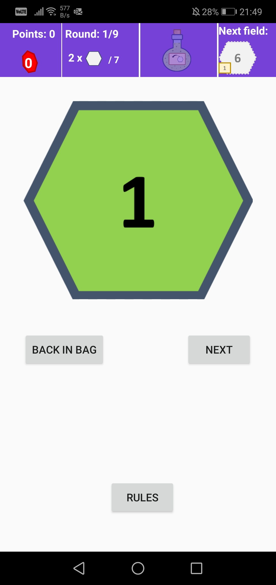
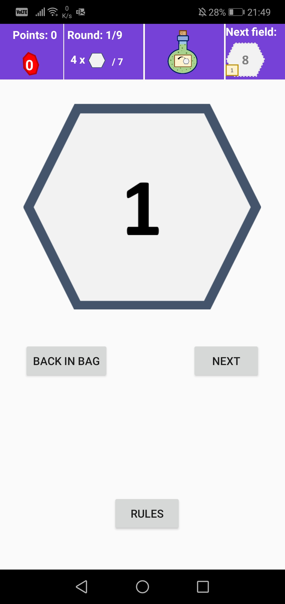
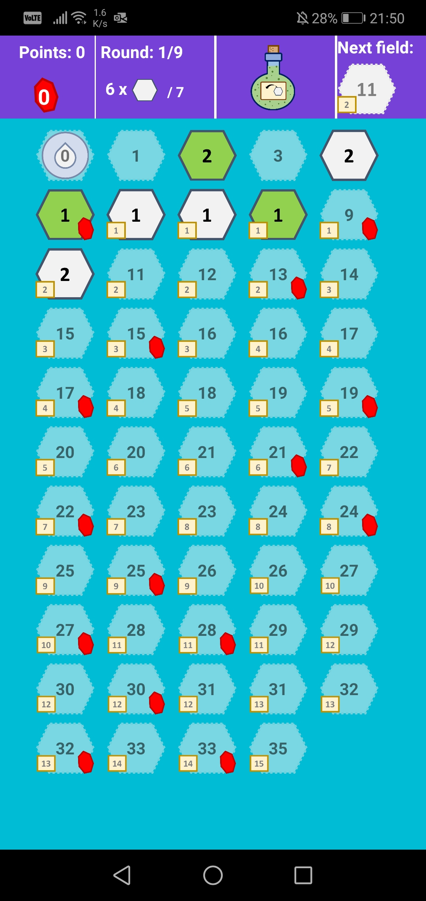
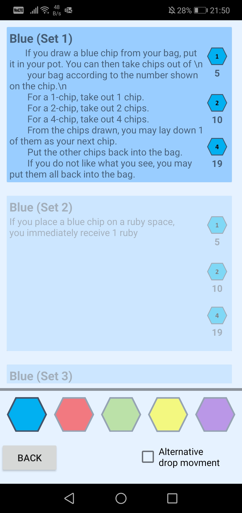
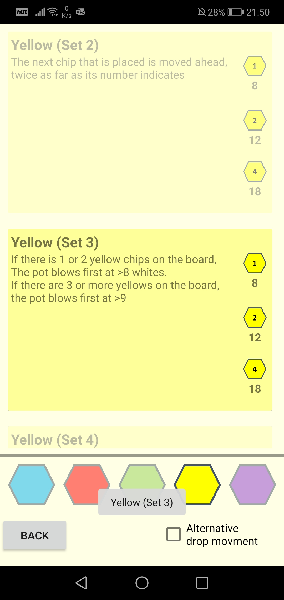
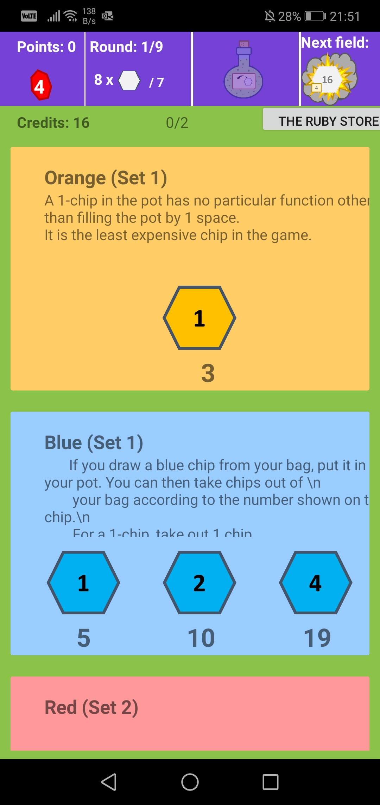
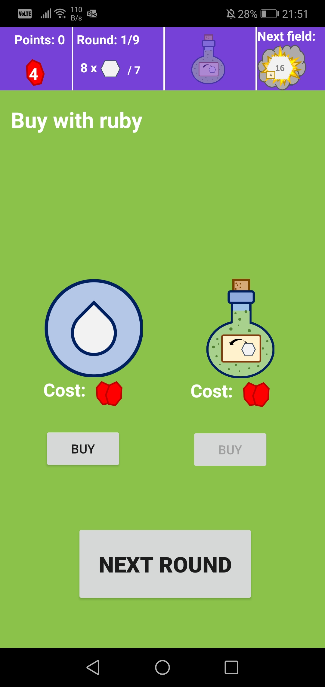
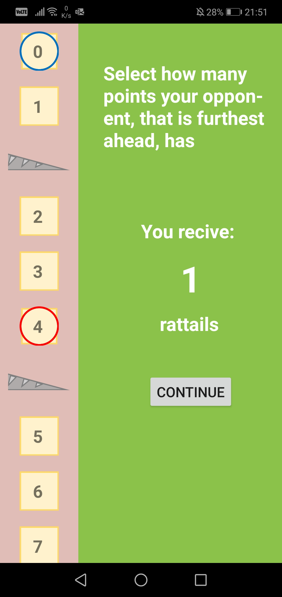

# LeQuacks
A appification of the board game ´The Quacks of Quedlinburg´ 

The real board game: https://boardgamegeek.com/boardgame/244521/quacks-quedlinburg 
The rules for the original board game: https://gusandco.net/wp-content/uploads/2018/10/Quacksalber_Rules_English_v1.pdf

<h3>Taking chip out of bag:</h3>

                   

<h3>Auto place them on the board:</h3>

                   

<h3>Several rules for each color to choose from:</h3>

                   

<h3>At the end of each round buy more chips and movment or flask refill with rubies:</h3>

                   

<h3>Select where the leading opponent is, to calculate the rattails to start from</h3>

